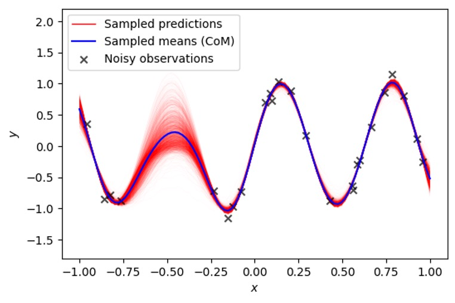
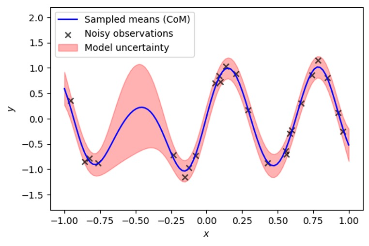
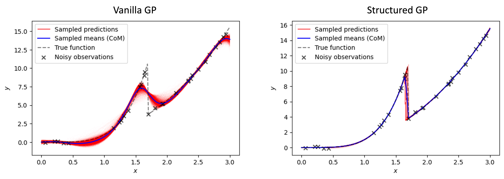
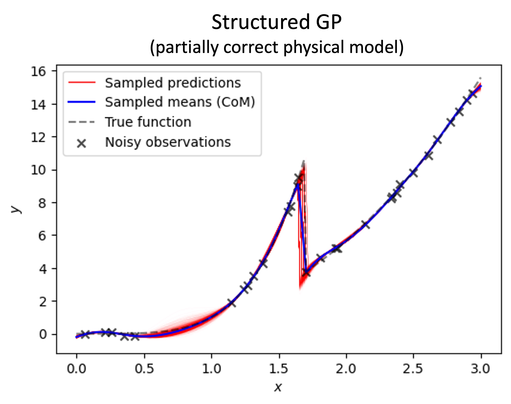

How To Use
==========

Simple GP
---------

The code snippet below shows how to use vanilla GP in a fully Bayesian mode. First, we infer GP model parameters from the available training data

.. code:: python

    import gpax
    # Get random number generator keys for training and prediction
    rng_key_train, rng_key_predict = gpax.utils.get_keys()
    # Initialize model
    gp_model = gpax.ExactGP(1, kernel='RBF')
    # Run Hamiltonian Monte Carlo to obtain posterior samples for the GP model parameters
    gp_model.fit(rng_key_train, X, y)  # X and y are numpy arrays with dimensions (n, d) and (n,)

In the fully Bayesian mode, we get a pair of predictive mean and covariance for each Hamiltonian Monte Carlo sample containing the GP parameters (in this case, the RBF kernel hyperparameters and model noise). Hence, a prediction on new inputs with a trained GP model returns the center of the mass of all the predictive means (``y_pred``) and samples from multivariate normal distributions for all the pairs of predictive means and covariances (``y_sampled``).

.. code:: python

    y_pred, y_sampled = gp_model.predict(rng_key_predict, X_test)



For 1-dimensional data, we can plot the GP prediction using the standard approach where the uncertainty in predictions - represented by a standard deviation in ```y_sampled``` - is depicted as a shaded area around the mean value.



Structured GP
-------------

The limitation of the standard GP is that it does not usually allow for the incorporation of prior domain knowledge and can be biased toward a trivial interpolative solution. Recently, we `introduced <https://arxiv.org/abs/2108.10280>`_ a structured Gaussian Process (sGP), where a classical GP is augmented by a structured probabilistic model of the expected system’s behavior. This approach allows us to `balance <https://towardsdatascience.com/unknown-knowns-bayesian-inference-and-structured-gaussian-processes-why-domain-scientists-know-4659b7e924a4>`_ the flexibility of the non-parametric GP approach with a rigid structure of prior (physical) knowledge encoded into the parametric model.
Implementation-wise, we substitute a constant/zero prior mean function in GP with a probabilistic model of the expected system's behavior.

For example, if we have prior knowledge that our objective function has a discontinuous 'phase transition', and a power law-like behavior before and after this transition, we may express it using a simple piecewise function

.. code:: python

    import jax.numpy as jnp

    def piecewise(x: jnp.ndarray, params: Dict[str, float]) -> jnp.ndarray:
        """Power-law behavior before and after the transition"""
        return jnp.piecewise(
            x, [x < params["t"], x >= params["t"]],
            [lambda x: x**params["beta1"], lambda x: x**params["beta2"]])

This function is deterministic. To make it probabilistic, we put priors over its parameters with the help of NumPyro

.. code:: python

    import numpyro
    from numpyro import distributions

    def piecewise_priors():
        # Sample model parameters
        t = numpyro.sample("t", distributions.Uniform(0.5, 2.5))
        beta1 = numpyro.sample("beta1", distributions.Normal(3, 1))
        beta2 = numpyro.sample("beta2", distributions.Normal(3, 1))
        # Return sampled parameters as a dictionary
        return {"t": t, "beta1": beta1, "beta2": beta2}

Finally, we train the sGP model and make predictions on new data in the almost exact same way we did for vanilla GP. The only difference is that we pass our structured probabilistic model as two new arguments (the piecewise function and the corresponding priors over its parameters) when initializing GP.

.. code:: python

    # Get random number generator keys
    rng_key_train, rng_key_predict = gpax.utils.get_keys()
    # Initialize structured GP model
    sgp_model = gpax.ExactGP(1, kernel='Matern', mean_fn=piecewise, mean_fn_prior=piecewise_priors)
    # Run MCMC to obtain posterior samples
    sgp_model.fit(rng_key_train, X, y)
    # Get GP prediction on new/test data
    y_pred, y_sampled = sgp_model.predict(rng_key_predict, X_test)



The probabilistic model reflects our prior knowledge about the system, but it does not have to be precise, that is, the model can have a different functional form, as long as it captures general or partial trends in the data. 

