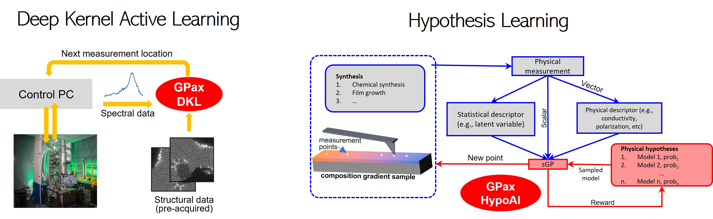

GPax: Gaussian Processes for Experimental Sciences
==================================================

GPax is a small Python package for physics-based Gaussian processes (GPs) built on top of NumPyro and JAX. Its purpose is to take advantage of prior physical knowledge and different data modalities when using GPs for data reconstruction and active learning. It is a work in progress, and more models will be added in the near future.

.. toctree::
   :maxdepth: 3
   :caption: Notes

   README.rst
   LICENSE.rst
   USAGE.rst

.. toctree::
   :glob:
   :caption: Package Content

   models
   hypo
   acquisition
   kernels
   utils

.. toctree::
   :maxdepth: 3
   :caption: Examples

   examples 
